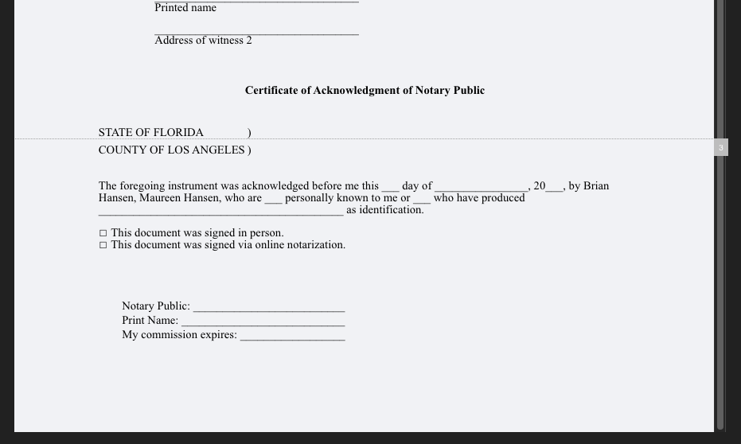
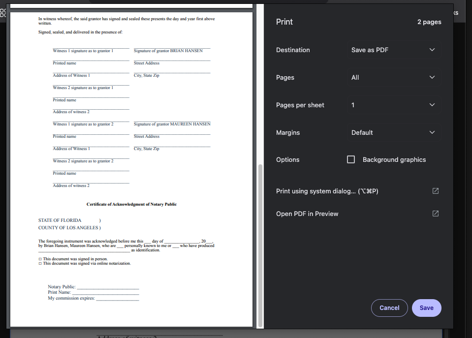

The project reproduces a problem with the CKEditor pagination plugin, where pagination lines are being drawn too early.

Steps to reproduce:
1) Start the backend: `npm run backend`
2) Start the frontend: `npm run frontend`
3) Open a browser and navigate to `http://localhost:8009/?file=florida-deed.html`

On the second page of the document, there will be a pagination line after the line which says "STATE OF FLORIDA    )". However, on the
print preview there is no page break in that location, and page two is the last page of the document.

The print preview can be displayed by pressing the 'P' button on the toolbar.

Screenshot of the pagination line:

Print preview:
